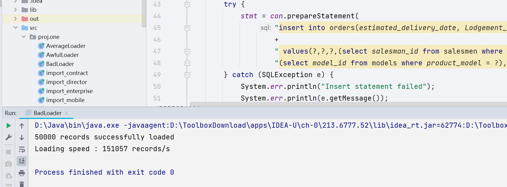
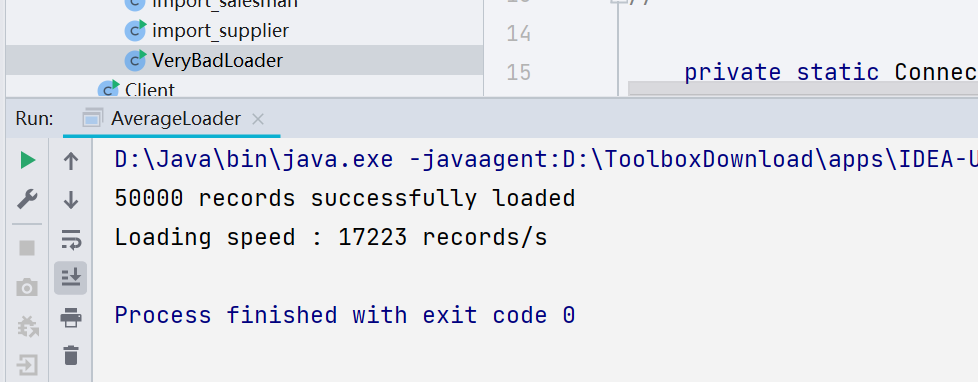
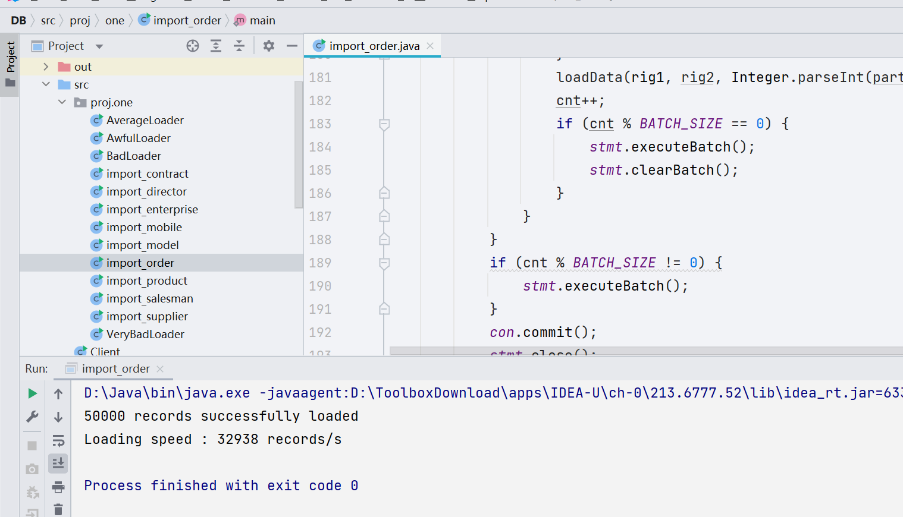
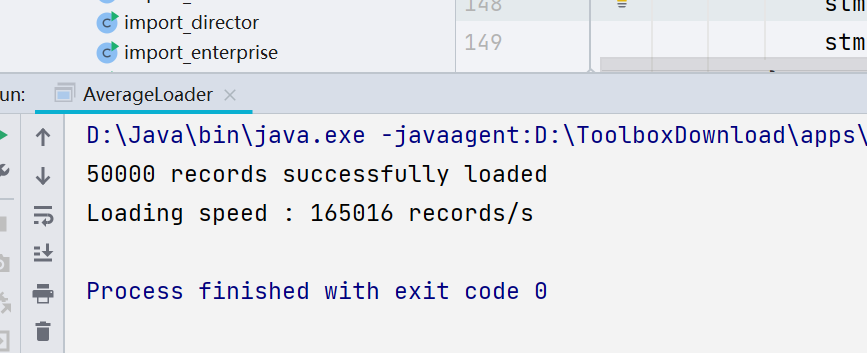

## part 3 import

| Level | Description                                                  |      Rate       | Data Size |
| :---: | :----------------------------------------------------------- | :-------------: | :-------: |
|   1   | No acceleration is used, and each read and write involves the establishment and disconnection of a database connection. |  22 records/s   |  50,000   |
|   2   | No acceleration operation is used, only keeping the database connection open during reading and writing data. | 4895 records/s  |  50,000   |
|   3   | The SQL statement of insert is compiled in advance by using pre-compilation, and the database connection is established and disconnected only once, and there is still no optimization in reading and writing data. | 8882 records/s  |  50,000   |
|   4   | We use the pre-compilation method to compile the insert SQL statement in advance, and only once to establish and disconnect the database connection. In terms of reading and writing data, we avoid writing data directly to disk for each insert operation, which is time consuming, so we use to write data to cache first, wait for inserted data to be stored in the cache, and then write them to disk together. | 17223 records/s |  50,000   |
|   5   | The SQL statements for insert are compiled in advance using pre-compilation and only one database connection is established and disconnected. The batch mechanism allows several SQL statements to be executed together. In terms of reading and writing data, the data is written to the cache first, and then written to disk after all the data to be inserted is stored in the cache. | 32938 records/s |  50,000   |
|   6   | We use pre-compilation to compile the insert SQL statement in advance, and only once to establish and disconnect the database connection. In terms of reading and writing data, the data is first written to the cache, and then written to disk after all the data to be inserted is stored in the cache. Batch processing is not used, after several tests, batch processing will greatly reduce the efficiency of insert statement execution. In addition, we disable trigger and foreign key checking, thus slightly improving the efficiency of insert statement execution. | 51599 records/s |  50,000   |

The table below shows the screenshots of the output results.

| Level |          Graph          |
| :---: | :---------------------: |
|   1   |      |
|   2   |  |
|   3   |          |
|   4   |  |
|   5   |        |
|   6   |    |

