# Report

## Group Information

| Name        | 林洁芳                                                       | 汤奕飞                                                       |
| ----------- | :----------------------------------------------------------- | ------------------------------------------------------------ |
| SID         | 12011543                                                     | 12011906                                                     |
| Lab session | Lab 2                                                        | Lab 2                                                        |
| Tasks       | Task 2, Task 3, Task 4(Basic requirements, High concurrency and thread safety) | Task 1, Task 2, Task 4(Privilege management and different DBMS) |

## Part 1 E-R Diagram


This Diagram is made with [ProcessOn](www.processon.com).

## Part 2 Database Design

### E-R diagram generated by DataGrip


### Description of tables and columns

We used the E-R model to design database. Since there are no many-to-many relationships, each table is a set of entities and foreign keys are used to represent one-to-many or one-to-one relationships. Orders, contracts, models and mobile phones are weak entity sets because they all depend on other entities for their existence. In particular, salesmen should exist with mobile_phones or supply center, but we still consider them to be independent of any entity. We always observe the three normal forms in designing. For example, we divide all people(including salesmen and directors) name into first name and surname for 1NF, we separate contracts and products from orders and models for 2NF and 3NF.

## Part 3 Data Import

### Basic data import

#### Script(take orders as a example)

```java
public class import_order {
    private static void openDB(String host, String dbname, String user, String pwd) {}
    private static void closeDB() {}
    private static void loadData(Date estimated_delivery_date, Date lodgement_date, int quantity, String number, String pro_model, String contract_number) throws SQLException {}
    public static void main(String[] args) {}
}

```

#### Description

For the sake of brevity, we extracted the raw data into several .txt files, corresponding to each table's data import. In each import.java file, we only need to adjust the parameters and their positions.

### Comparative analysis of computational efficiencies between different ways in importing

| Level | Description                                                  |      Rate       | Data Size |
| :---: | :----------------------------------------------------------- | :-------------: | :-------: |
|   1   | No acceleration is used, and each read and write involves the establishment and disconnection of a database connection. |  22 records/s   |  50,000   |
|   2   | No acceleration operation is used, only keeping the database connection open during reading and writing data. | 4895 records/s  |  50,000   |
|   3   | The SQL statement of insert is compiled in advance by using pre-compilation, and the database connection is established and disconnected only once, and there is still no optimization in reading and writing data. | 8882 records/s  |  50,000   |
|   4   | We use the pre-compilation method to compile the insert SQL statement in advance, and only once to establish and disconnect the database connection. In terms of reading and writing data, we avoid writing data directly to disk for each insert operation, which is time consuming, so we use to write data to cache first, wait for inserted data to be stored in the cache, and then write them to disk together. | 17223 records/s |  50,000   |

| 5    | The SQL statements for insert are compiled in advance using pre-compilation and only one database connection is established and disconnected. The batch mechanism allows several SQL statements to be executed together. In terms of reading and writing data, the data is written to the cache first, and then written to disk after all the data to be inserted is stored in the cache. | 32938 records/s | 50,000 |
| ---- | ------------------------------------------------------------ | --------------- | ------ |
| 6    | We use pre-compilation to compile the insert SQL statement in advance, and only once to establish and disconnect the database connection. In terms of reading and writing data, the data is first written to the cache, and then written to disk after all the data to be inserted is stored in the cache. Batch processing is not used, after several tests, batch processing will greatly reduce the efficiency of insert statement execution. In addition, we disable trigger and foreign key checking, thus slightly improving the efficiency of insert statement execution. | 51599 records/s | 50,000 |

The screenshots of the output results can be seen in fold graphs.

## Part 4 Compare DBMS with File I/O

### Description of your test environment

If you need to test, use Java and you can use JDK17 with PostgreSQL configured. The test environment requirements are not strict.

#### Hardware specification

CPU Model: 12th Gen Intel(R) Core(TM) i7-12700H 2.70 GHz, AMD Ryzen 7 5800H with Radeon Graphics 3.20 GHz

Memory size: 16.0 GB

Disk: SSD

#### Software specification

DBMS: PostgreSQL 14.2, SQLite 3.38.2

OS: Windows 11 家庭中文版 21H2

Programming language: Java, SQL

Development environment: IntelliJ IDEA 2022.1 (Community Edition), DataGrip 2022.1.1

### Specification of test data

#### DDLs

```sql
create table orders
(
    order_id                serial primary key,
    estimated_delivery_date date    not null,
    lodgement_date          date,
    quantity                integer not null,
    salesman_id             integer not null references salesmen,
    model_id                integer not null references models,
    contract_number         varchar not null references contracts
);
```


#### Data format

Separated by **commas**.

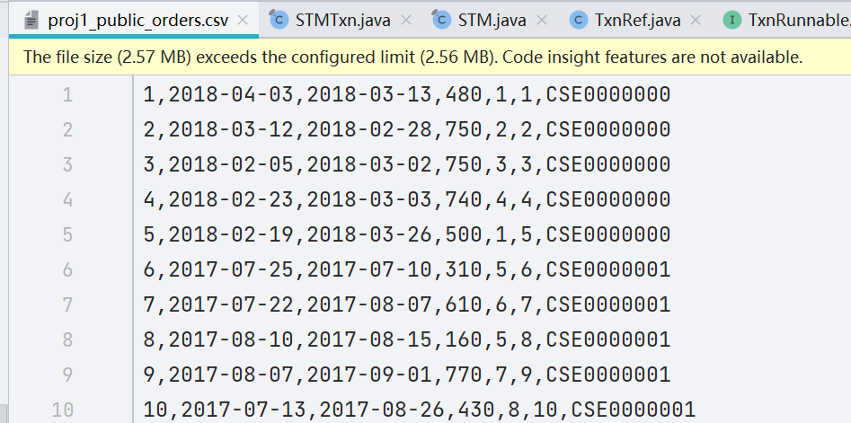

### Description of code

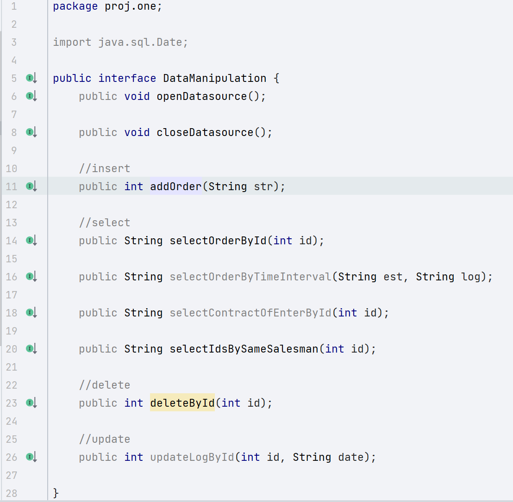

The graph above shows the methods we tested for insert, delete, update and select. The lookup statement is divided into three different levels of difficulty, which will be explained in detail in the next section(**Comparative study**), and the complete code is attached separately.

### Comparative study

#### Insert-Efficiency Comparison

Using a Java script to generate 300,000 test data, we test the performance difference between file and database in terms of inserting data using these 300,000 pieces of data. First, a single thread, the main thread, is tested for inserting data. This screenshot below is a screenshot of **generating a data file**, reading the information in that file, simulating a database insert operation, and inserting the data into the **proj1.public.orders.csv** file.

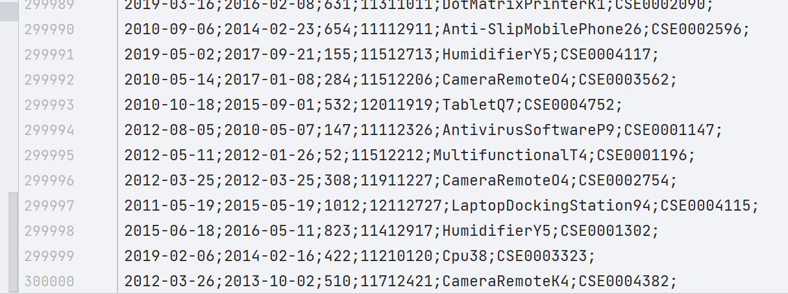

```sql
-- the sql statement of inserting the data into the table named orders;
insert into orders(estimated_delivery_date, Lodgement_date, quantity, salesman_id, model_id, contract_number) 
values(?,?,?,
       (select salesman_id from salesmen where salesman_number = ?),
       (select model_id from models where product_model = ?),?);
```

The file is 50,000 data before inserting data, and 350,000 data after inserting, which proves that the insertion is successful.

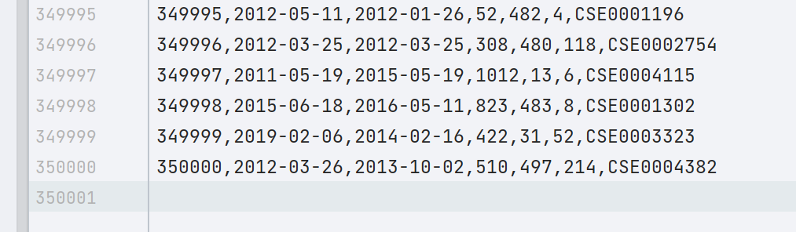

We do not turn off insert checking of the database, including foreign key checking, and do not apply batch processing, do not take advantage of traversal acceleration of transactions (writing first to the cache and then to disk together), that is, **we do not use acceleration to allow the database to be compared with the file system**.

| Insertion Efficiency |                  Screenshot                  |
| :------------------: | :------------------------------------------: |
|         DBMS         |  |
|         File         |      |

As can be seen from the table above, database inserts may not actually be as fast as file inserts, for several reasons:

1. To establish a connection to the database, which consumes a certain amount of time, while the file can be opened directly and takes less time;
2. The database is pre-compiled for insert statements and requires data type conversion (from String type data to the required type) for date variables, etc., while the file can be written directly with String type data spliced in;
3. The database consumes some time due to insertion checks (e.g. foreign key checks, trigger), which are back, while the file does not have to perform any checks before writing;
4. The database needs to commit the operation to the server for execution as a transaction, while the file is written directly locally;
5. Database writes follow a certain data structure rather than sequential insertion, while file writes are sequential insertion;

The following graph reflects the results of five tests, **IO is roughly twice as fast as DBMS**.

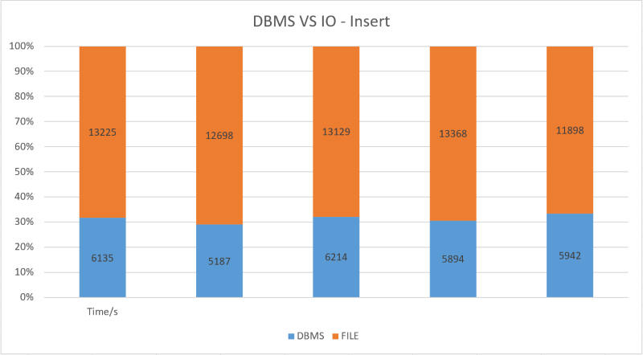

In summary, the database can handle large data very well, so for the operation of inserting data, the database will be about twice as slow as simply writing to a local file in order to ensure that each variable of the data makes sense and that it is easy to query later.

#### select-Efficiency Comparison

##### 1.\<easy>select id

The search is very routine and is a lookup of a certain self-incrementing id variable with the following sql statement.

```sql
select * from orders where order_id = ?;
```

The following table is a comparison of the query efficiency of file and database. The file system will load the table data in **hashmap** in advance, so the query efficiency of the file system is higher based on the database system which also has to establish connection with the client and pass commands, etc.

| Efficiency |                Screenshot                |
| :--------: | :--------------------------------------: |
|    DBMS    |  |
|    File    |      |

##### 2.\<middle>select client enterprise name

The search statement uses two joins, using the convenience of the database, the three tables of data correspondence, so as to find **the order is responsible for the name of the client enterprise**.

```sql
select ce.name as nm
from orders
         join contracts c on c.contract_number = orders.contract_number
         join client_enterprises ce on ce.client_enterprise_id = c.client_enterprise_id
where order_id = ?;
```

| Efficiency |                    Screenshot                    |
| :--------: | :----------------------------------------------: |
|    DBMS    |  |
|    File    |      |

From the above table, we can see that the file search is many times faster than the database search. In fact, in the class loading stage, the file system has stored the table information in the **hashmap** separately, and since the lookups are all using the **hashmap**, the time complexity of each lookup is **O(1)**, so it is reasonable to be able to be **10 times** more efficient than the database system.

Since the database system utilizes the join (inner join) keyword, it means that a new table needs to be generated before the query can be performed. The inner join creates a new result table by combining the column values of two tables **(table1 and table2)** based on the join predicate. The query **compares each row in table1 with each row in table2 and finds all matching pairs of rows that satisfy the join predicate**. When the join predicate is satisfied, the column values of each matching pair in rows A and B are combined into one result row. Therefore, this operation consumes a lot of time and is an important reason why database search is slower than file search.

##### 3.\<different>select each salesman responsible for orders

This query statement is designed to find out which orders the same salesman is responsible for.

- For file systems, each query iterates through the hashmap once, which is loaded with data at the time of class loading. 

- For database systems, each query generates a sub-table, from which the data is then summarized into a string using an aggregate function.

An example of a sample query:

```sql
select sub.salesman_id, string_agg(cast(order_id as varchar), ',') as ors
from (
         select distinct order_id, salesman_id
         from orders) sub
-- salesman_id can be 1 to 990(all the salesmen)
where salesman_id = 1
group by sub.salesman_id;
```

This query result is:

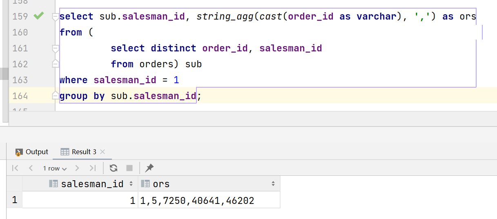

| Efficiency |                        Screenshot                        |
| :--------: | :------------------------------------------------------: |
|    DBMS    |  |
|    File    |          |

The above table reflects the small difference in efficiency between the file system and the database system. The database system is slightly slower due to uploading transactions, converting data types, and using aggregate functions. 

The following figure is a comparison chart of 3 types of queries, IO is always more efficient than DBMS, but the difference of their efficiency **is not consistent according to the different difficulty of the query.**

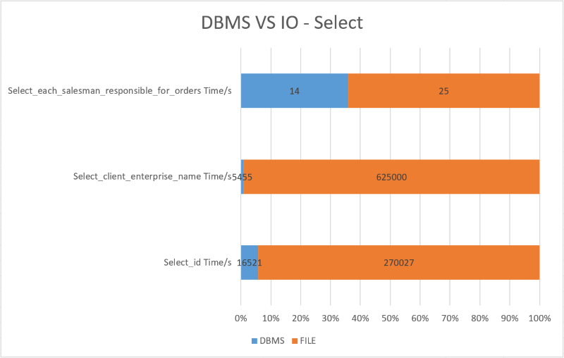

The above query and insert statements do not reflect the advantages of the database system. Some of the databases have their own security checks, transactions take time to upload, and building data structures to facilitate searching also consumes a lot of time, and there is a certain amount of processing when using the file system.

- Initialize the data in the table with static blocks and use the hashmap as a container.
- Taking advantage of the hashmap key-value pairs, it can be achieved with O(1) complexity when finding value by key instead of traversing it once.

#### delete&update-Efficiency Comparison

The **delete statement** for the file system is to delete the value in the hashmap and rewrite the file, while the database system does not really delete the data, but **a logical deletion**, that is, the underlying database actually just gives the deleted data a deleted mark, so the size of the table after the deletion of data and before the deletion is the same, which eliminates the time consumption of rewriting and improves the efficiency of deletion.

| Efficiency |              Screenshot              |
| :--------: | :----------------------------------: |
|    DBMS    |  |
|    File    |      |

The **update statement** for the file system is to rewrite the file after updating the value in the hashmap, while the database system can add the corresponding data and avoid the process of file deletion and rewriting.

| Efficiency |              Screenshot              |
| :--------: | :----------------------------------: |
|    DBMS    |  |
|    File    |      |

The following two figures reflect the results of five tests of delete operations and update operations **with IO tens of times slower than DBMS.**

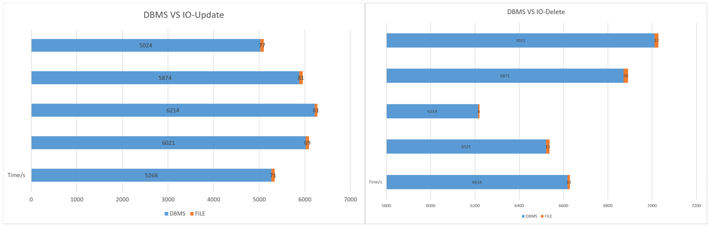

It is obvious from the execution efficiency of update and delete that the file system has a big performance loophole. Since the file system cannot operate on the inside of the file, such as not being able to delete one of the rows or modify the value of one of the rows, so the command involving modification has to rewrite the file once, which greatly reduces the efficiency, while the delete and add operations of the database can effectively avoid the performance loss caused by frequent file writes after special processing in the bottom layer, such as marking.

### *High concurrency and thread safety

#### Introduction

A very prominent highlight of the database is that transactions can maintain thread safety well and effectively handle high concurrency (i.e. multiple requests at the same time). **sql** statements are converted into transactions and submitted to the server, and then the database does the processing of inserting, deleting, selecting, and updating. However, if the file alone is used to store and process data, it will lose security because the file read and write does not automatically maintain thread safety, and naturally does not have the ability to handle high concurrency, so if you want to protect the thread safety of file read and write and data process, you have to **manually lock**.

As you can see in the class variable declaration below, we declare a **StampedLock object** as a static global variable to protect other global variables from being read and written safely in multiple threads, i.e., we use locks to handle the high concurrency of file reads and writes.

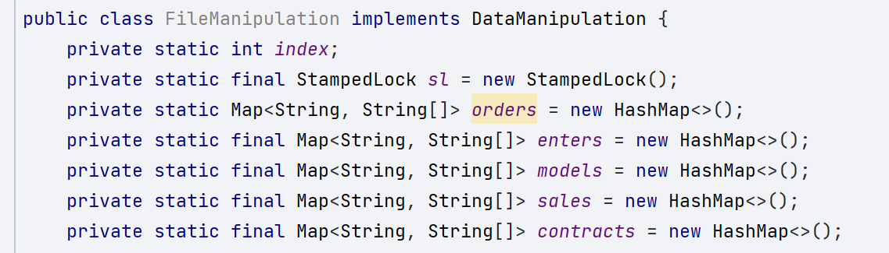

In fact, **StampedLock** is a new read/write lock added to Java 8, which is an improvement on **ReentrantReadWriteLock**. the synchronization state of **StampedLock** contains a version and a pattern, the methods that get the lock return a stamp indicating the state of the lock, and the "try" version of these methods returns a special value 0 means that the lock failed to be acquired.

Locks can be distinguished as read locks and write locks, which can improve the efficiency of program operation, because read locks can be used without locks in some cases, unless another thread modifies the data while that thread is reading it. Therefore, **StampedLock, as an advanced version of ReadWriteLock, supports three modes, namely, write lock, pessimistic read lock and optimistic read**, in which optimistic read allows multiple threads to read at the same time, while allowing a thread to obtain a write lock, which means that not all write operations are blocked. This improves the efficiency of program operation.

So the locking method of read locks is more complicated than that of write locks.

```java
//Inside the method:
//The first step is to get the optimistic read state of the StampLock object, which means that the optimistic read lock is put on first.
long stamp = sl.tryOptimisticRead();
//The specific process of reading.
//If the return value is false, it means that another thread has modified the same object during the optimistic read, so a pessimistic lock is needed to re-read the data.
if (!sl.validate(stamp)){
  //Upgrade optimism lock to pessimism lock.
  stamp = sl.readLock();
  try {
    //The specific process of reading(read again!).
  } finally {
    //Release the pessimistic lock.
    sl.unlockRead(stamp);
  }
}
```

Read locks are relatively much simpler because reads must be allowed to be operated by only one thread.

```java
//Read lock here.
long stamp = sl.writeLock();
try {
    //Make changes to the data.
} finally {
    //Release the read lock.
    sl.unlockWrite(stamp);
}
```

#### Result

To improve the security of **IO** and make it able to handle multiple concurrency (using multiple threads), we add a lock to **FileManipulation**.

```java
import java.io.BufferedReader;
import java.io.FileReader;
import java.io.IOException;
import java.util.ArrayList;

public class ClientMultiThread extends Thread{
    private static final ArrayList<String> items = new ArrayList<>();
    private static int count = 0;
    private final int index;
    ClientMultiThread(){
        count++;
        this.index = count;
    }
    int getIndex(){
        return this.index;
    }
    //Static block, loaded with the class.
    static {
        String item;
        try (BufferedReader bufferedReader = new BufferedReader(
            new FileReader("extraData.txt"))) {
            while ((item = bufferedReader.readLine()) != null) {
                items.add(item);
            }
        } catch (IOException e) {
            e.printStackTrace();
        }
    }
    @Override
    //The thread body, after starting the thread, will execute the code inside the run function;
    public void run(){
        DataManipulation dm = new DataFactory().createDataManipulation("file");
        long start = System.currentTimeMillis();
        dm.openDatasource();
        int size = items.size();
        for (String item : items) {
            dm.addOrder(item);
        }
        System.out.println(this.index + " " + dm.selectOrderById(50002));
        System.out.println(this.index + " " + dm.selectIdsBySameSalesman(3));
        dm.deleteById(50012);
        System.out.println(this.index + " " + dm.selectOrderById(50010));
        dm.closeDatasource();
        long end = System.currentTimeMillis();
        System.out.println(this.index + " spend time: "
            + (end - start) + "s");
    }
    //Start two threads at the same time.
    public static void main(String[] args) {
        ClientMultiThread thread1 = new ClientMultiThread();
        ClientMultiThread thread2 = new ClientMultiThread();
        thread1.start();
        thread2.start();
    }
}
```

We can get the **following results**. From the results, we can see that the information between threads is consistent, indicating that information is shared between threads and **locks do not affect the information visible between threads**.

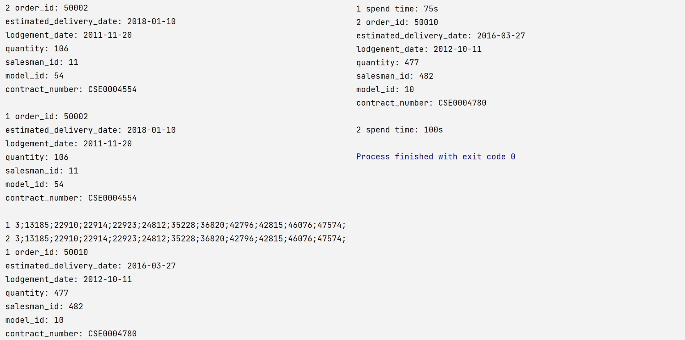

From the results of writing to the file(below), it can be proved that the write lock can maintain the thread safety well, and writing 10 data at the same time (writing to the file) and deleting one of them (clearing the file and rewriting it) did not make any error in the data. Therefore, the correct use of locks can maintain thread safety, handle high concurrency, and thus better simulate the characteristics of database transactions.


#### *Extra

The **transaction management mechanism** of database is unique in the field of handling high concurrency, so we can refer to the transaction management mechanism of database and thus design **Software Transactional Memory (STM for short)**.

Although Java does not support **STM**, it can be supported by a third-party library called **Multiverse**. We implemented STM ourselves instead of using third-party libraries, but we still decided to use locks.

**All read and write operations on data must be inside a transaction**.

- **VersionedRef**: wraps the object value into an object with a version number (according to MVCC(Multi-Version Concurrency Control) theory, each modification of the data corresponds to a unique version number, so there is no case of just changing the value or version, using the invariant pattern can solve this problem very well, so VersionedRef class is designed to be (immutable).
- **TxnRef**: completes the read and write operations within the transaction, the read and write operations are delegated to the interface Txn.
- **Txn**: The current transaction in which the read/write operation is located, and the internal curRef represents the latest value in the system.
- **STMTxn**: is an implementation class of Txn, **complete the transaction for the data read and write**. There are two internal Map, one **inTxnMap**, used to save a snapshot of all the data read and written in the current transaction, and the second, **writeMap**, used to save the data that needs to be written in the current transaction. Each transaction has a unique transaction **ID txnId**, which is incremented globally. There are three core methods, the get() method for reading data, the set() method for writing data, and the commit() method for committing the transaction.

### User Privilege Management

#### DBMS

We first create three roles with different privileges.

```sql
create role cs307 with password 'pswd';
create user cs308 with password 'pswd';
create user cs309 superuser;
alter user cs309 password 'pswd';
```

We list the roles.

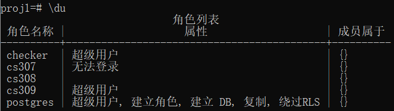

It can be found that cs307 is not allowed to log in.

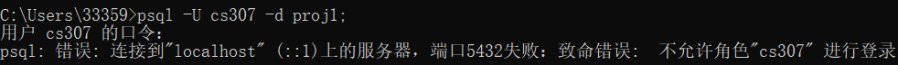

cs308 can login.

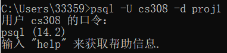

Then we try to operate as user cs308.

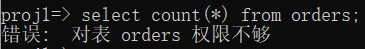

We log in to superuser cs309 and give cs308 privilege to select in the orders table.


Using cs308 select again, it now works.

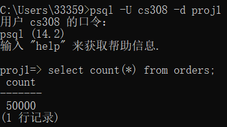

And then try to select other tables, privilege is not enough.

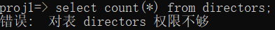

Then, we remove these roles.

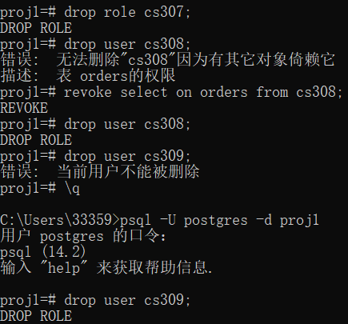

From this, we can see that DBMS manages user rights strictly and clearly. Therefore, it is very easy to manage user privilege with DBMS.

#### File

I simply constructed the Users class without storing user information and priority information, as I soon found it difficult to use user rights management in files. We can implement this by adding a different statement with a layer of judgement on priority, using the same method to store the file with encrypted users, then the file can only be accessed by the user who created it, making the file more secure. However, for file systems. If one can directly access a file in a folder and open it with other software, then he can delete or add any character, add anything he wants. For users who do not have privilege to do so, it is easy to even destroy files. As the following example shows.

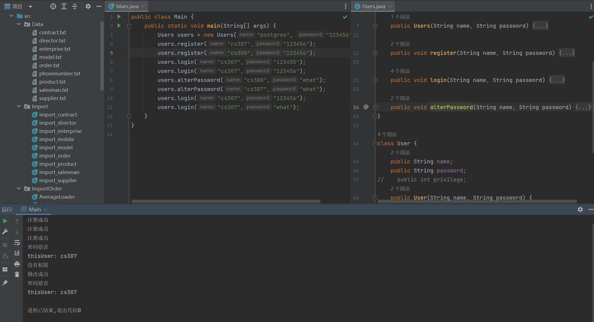

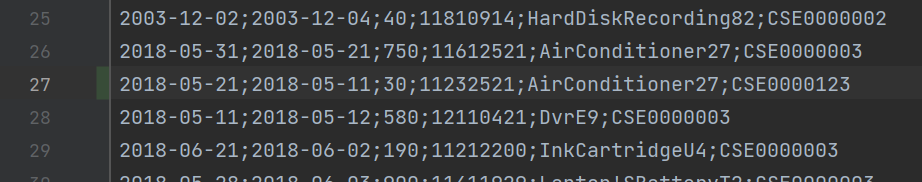

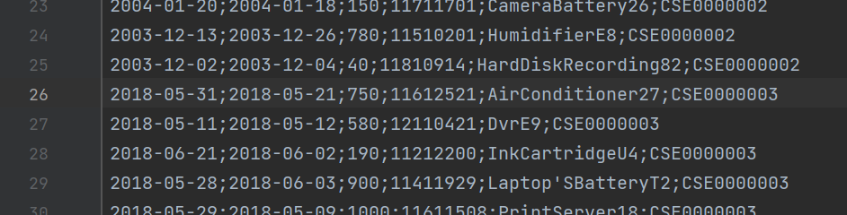

#### Conclusion

As we can see from this section, in terms of privilege management, it is much more difficult to implement such privilege management in a file system than in a DBMS. Secondly, if the administrator of the file system wants to implement privilege management, then he needs to make sure that the user cannot access any code or file directly. In short, for a user like me, privilege management in a file system is not only weaker than in a DBMS, but also more difficult to implement.

### Comparison of different DBMS

We briefly compared the performance of PSQL and SQLite from four statements, as shown below. The horizontal axis unit is the number of sql statements and the vertical axis unit is the percentage and time (milliseconds) taken.

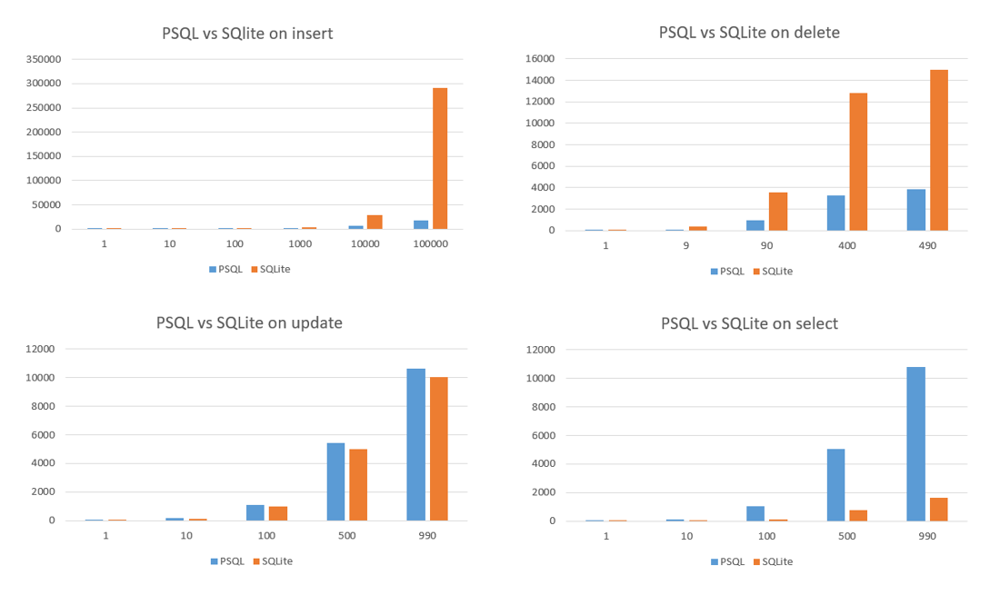

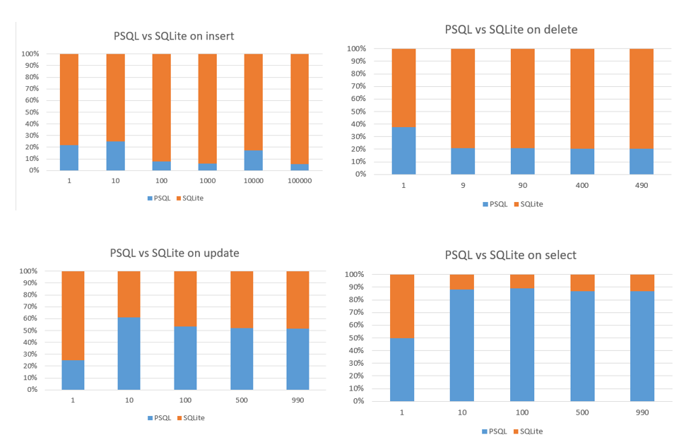

#### Conclusion

We found that postgreSQL has a clear advantage in insert and delete, but not as good as SQLite in select. They are on par when it comes to update.
