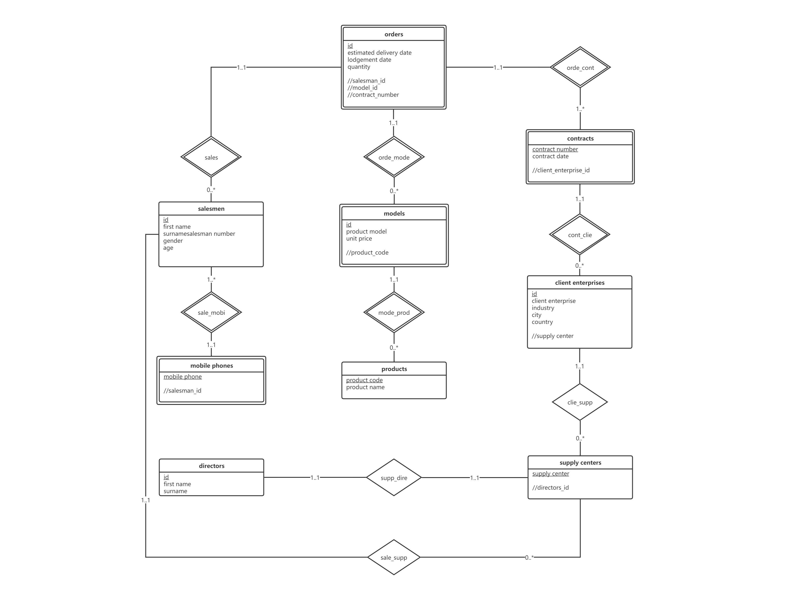
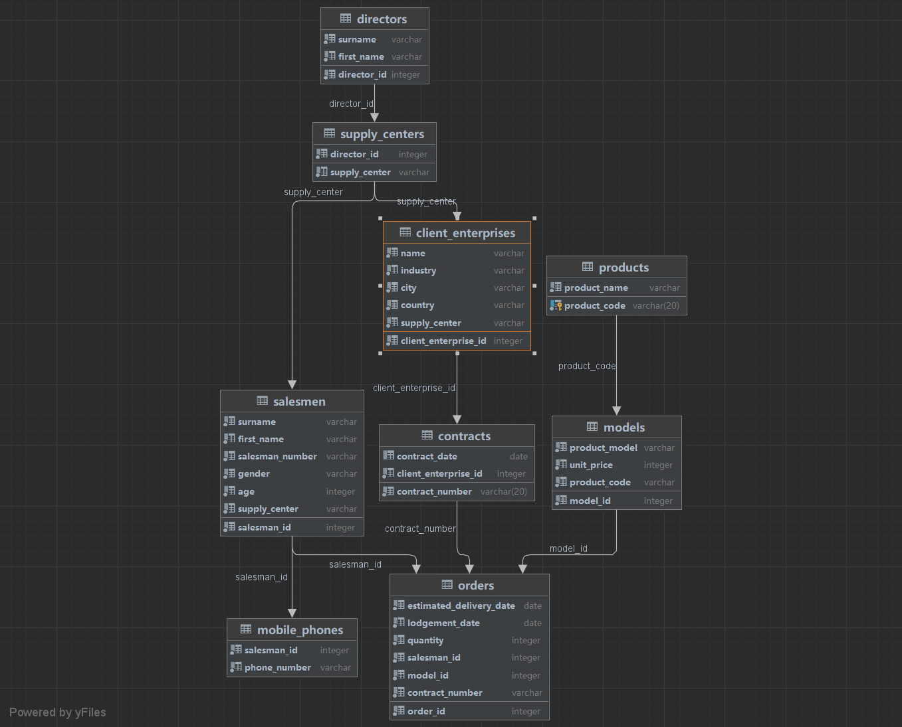
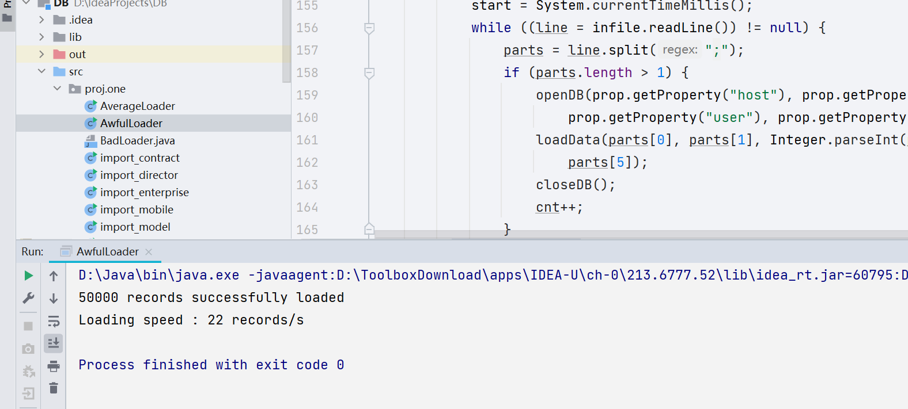
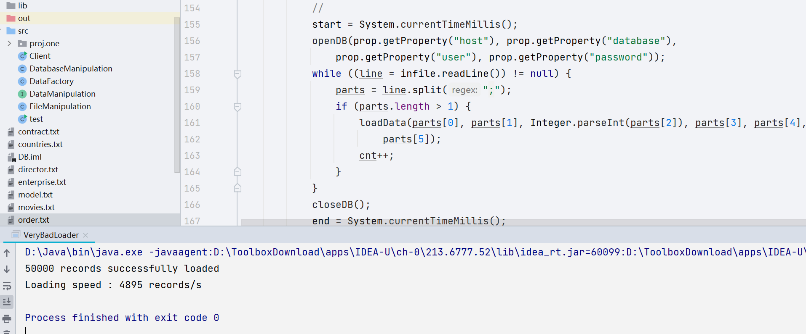
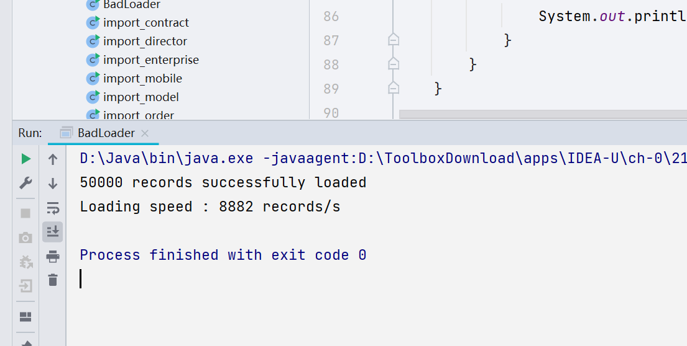
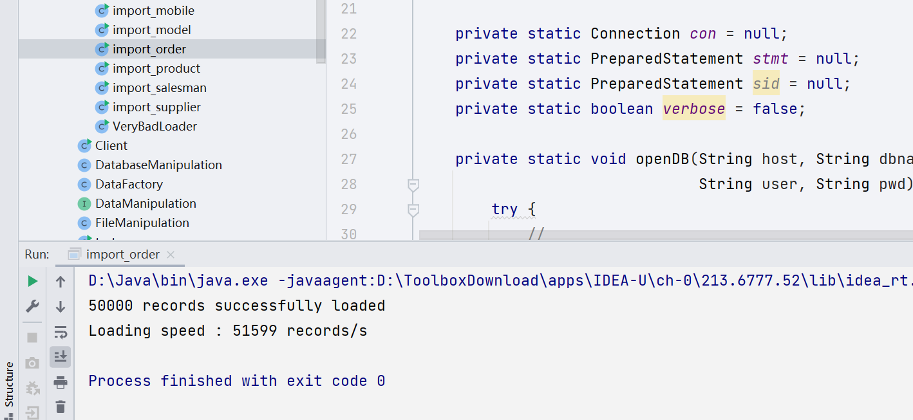

# Report

## Group Information

| Group member | Member 1 | Member 2 |
| ------------ | -------- | -------- |
| Name         | 林洁芳   | 汤奕飞   |
| Student ID   | 12011543 | 12011906 |
| Lab session  | Lab 2    | Lab 2    |

## Part 1 E-R Diagram



This Diagram is made with [ProcessOn](www.processon.com).

## Part 2 Database Design

### E-R diagram generated by DataGrip



### Description of tables and columns

We used the E-R model to design database. Since there are no many-to-many relationships, each table is a set of entities and foreign keys are used to represent one-to-many or one-to-one relationships. Orders, contracts, models and mobile phones are weak entity sets because they all depend on other entities for their existence. In particular, salesmen should exist with mobile_phones or supply center, but we still consider them to be independent of any entity. We always observe the three normal forms in designing. For example, we divide all people(including salesmen and directors) name into first name and surname for 1NF, we separate contracts and products from orders and models for 2NF and 3NF.

- directors: In this table, there are first name and surname of directors, with the serial primary key director_id to identify directors uniquely.
- supply_centers: In this table, there are supply_center of their unique name as primary key, and the foreign key of their directors' id.
- client_enterprises: In this table, there are name(unique), industry, city, country and supply_center of enterprises, with the serial primary key client_enterprise_id.
- contracts: In this table, there are contract_date, foreign key of client_enterprise_id, and the contract_number as the primary key.
- salesmen: In this table, there are first name, surname, salesman_number(unique), gender, age, supply_center of salesmen, with the serial primary key salesman_id.
- mobile_phones: In this table, there are only salesman_id as primary key and the phone_number to indicate the one-to-many relation ship, considering the possibility of one having multiple phone numbers.
- products: In this table, there are products' codes as primary key and their names.
- models: In this table, there are models' names(unique) and their corresponding prices and codes, with the serial primary key model_id.
- orders: In this table, there are estimated delivery dates, lodgement dates, quantities of orders, and foreign keys of salesman_id, model_id, contract_number to indicate order's subordination to them, with the serial primary key order_id.

## Part 3 Data Import

### Basic data import

#### Script(take orders as a example)

```java
import java.io.BufferedReader;
import java.io.FileReader;
import java.io.IOException;
import java.sql.Connection;
import java.sql.Date;
import java.sql.DriverManager;
import java.sql.PreparedStatement;
import java.sql.SQLException;
import java.sql.Statement;
import java.text.SimpleDateFormat;
import java.util.Objects;
import java.util.Properties;

public class import_order {
    private static final int BATCH_SIZE = 500;

    private static Connection con = null;
    private static PreparedStatement stmt = null;
    private static PreparedStatement sid = null;
    private static boolean verbose = false;

    private static void openDB(String host, String dbname,
                               String user, String pwd) {
        try {
            Class.forName("org.postgresql.Driver");
        } catch (Exception e) {
            System.err.println("Cannot find the Postgres driver. Check CLASSPATH.");
            System.exit(1);
        }
        String url = "jdbc:postgresql://" + host + "/" + dbname;
        Properties props = new Properties();
        props.setProperty("user", user);
        props.setProperty("password", pwd);
        try {
            con = DriverManager.getConnection(url, props);
            if (verbose) {
                System.out.println("Successfully connected to the database "
                    + dbname + " as " + user);
            }
            con.setAutoCommit(false);
        } catch (SQLException e) {
            System.err.println("Database connection failed");
            System.err.println(e.getMessage());
            System.exit(1);
        }
        try {
            stmt = con.prepareStatement(
                "insert into orders(estimated_delivery_date, Lodgement_date, quantity, salesman_id, model_id, contract_number)"
                    +
                    " values(?,?,?,(select salesman_id from salesmen where salesman_number = ?)," +
                    "(select model_id from models where product_model = ?),?)");
        } catch (SQLException e) {
            System.err.println("Insert statement failed");
            System.err.println(e.getMessage());
            closeDB();
            System.exit(1);
        }
    }

    private static void closeDB() {
        if (con != null) {
            try {
                if (stmt != null) {
                    stmt.close();
                }
                con.close();
                con = null;
            } catch (Exception e) {
                // Forget about it
            }
        }
    }

    private static void loadData(Date estimated_delivery_date, Date lodgement_date,
                                 int quantity, String number, String pro_model,
                                 String contract_number)
        throws SQLException {
        if (con != null) {
            try {
                stmt.setDate(1, estimated_delivery_date);
                stmt.setDate(2, lodgement_date);
                stmt.setInt(3, quantity);
                stmt.setString(4, number);
                stmt.setString(5, pro_model);
                stmt.setString(6, contract_number);
                stmt.addBatch();
            } catch (Exception e) {
                System.out.println(e);
            }
        }
    }

    public static void main(String[] args) {
        String fileName = null;
        boolean verbose = false;

        switch (args.length) {
            case 1:
                fileName = args[0];
                break;
            case 2:
                switch (args[0]) {
                    case "-v":
                        verbose = true;
                        break;
                    default:
                        System.err.println("Usage: java [-v] GoodLoader filename");
                        System.exit(1);
                }
                fileName = args[1];
                break;
            default:
                System.err.println("Usage: java [-v] GoodLoader filename");
                System.exit(1);
        }

        Properties defprop = new Properties();
        defprop.put("host", "localhost");
        defprop.put("user", "postgres");
        defprop.put("password", "216122");
        defprop.put("database", "proj1");
        Properties prop = new Properties(defprop);

        try (BufferedReader infile
                 = new BufferedReader(new FileReader(fileName))) {
            long start;
            long end;
            String line;
            String[] parts;
            int cnt = 0;
            
            openDB(prop.getProperty("host"), prop.getProperty("database"),
                prop.getProperty("user"), prop.getProperty("password"));
            Statement stmt0;
            if (con != null) {
                stmt0 = con.createStatement();
                stmt0.execute("truncate table orders");
                stmt0.execute("alter table orders disable trigger all");
                stmt0.close();
            }
            closeDB();
            
            start = System.currentTimeMillis();
            openDB(prop.getProperty("host"), prop.getProperty("database"),
                prop.getProperty("user"), prop.getProperty("password"));
            while ((line = infile.readLine()) != null) {
                parts = line.split(";");
                if (parts.length > 1) {
                    SimpleDateFormat format = new SimpleDateFormat("yyyy-MM-dd");
                    java.util.Date d1 = null;
                    java.util.Date d2 = null;
                    try {
                        d1 = format.parse(parts[0]);
                        if (!Objects.equals(parts[1], "")) {
                            d2 = format.parse(parts[1]);
                        }
                    } catch (Exception e) {
                        e.printStackTrace();
                    }
                    assert d1 != null;
                    Date rig1 = new Date(d1.getTime());
                    Date rig2 = null;
                    if (d2 != null) {
                        rig2 = new Date(d2.getTime());
                    }
                    loadData(rig1, rig2, Integer.parseInt(parts[2]), parts[3], parts[4], parts[5]);
                    cnt++;
                    if (cnt % BATCH_SIZE == 0) {
                        stmt.executeBatch();
                        stmt.clearBatch();
                    }
                }
            }
            if (cnt % BATCH_SIZE != 0) {
                stmt.executeBatch();
            }
            con.commit();
            stmt.close();
            closeDB();
            end = System.currentTimeMillis();
            System.out.println(cnt + " records successfully loaded");
            System.out.println("Loading speed : "
                + (cnt * 1000) / (end - start)
                + " records/s");
        } catch (SQLException se) {
            System.err.println("SQL error: " + se.getMessage());
            try {
                con.rollback();
                stmt.close();
            } catch (Exception e2) {
            }
            closeDB();
            System.exit(1);
        } catch (IOException e) {
            System.err.println("Fatal error: " + e.getMessage());
            try {
                con.rollback();
                stmt.close();
            } catch (Exception e2) {
            }
            closeDB();
            System.exit(1);
        }
        closeDB();
    }
}

```

#### Description

> A description of how you use the script to import data. You should clearly state the steps, necessary prerequisites, and cautions in order to run the script and import data correctly.

### Comparative analysis of computational efficiencies between different ways in importing

| Level | Description                                                  |      Rate       | Data Size |
| :---: | :----------------------------------------------------------- | :-------------: | :-------: |
|   1   | No acceleration is used, and each read and write involves the establishment and disconnection of a database connection. |  22 records/s   |  50,000   |
|   2   | No acceleration operation is used, only keeping the database connection open during reading and writing data. | 4895 records/s  |  50,000   |
|   3   | The SQL statement of insert is compiled in advance by using pre-compilation, and the database connection is established and disconnected only once, and there is still no optimization in reading and writing data. | 8882 records/s  |  50,000   |
|   4   | We use the pre-compilation method to compile the insert SQL statement in advance, and only once to establish and disconnect the database connection. In terms of reading and writing data, we avoid writing data directly to disk for each insert operation, which is time consuming, so we use to write data to cache first, wait for inserted data to be stored in the cache, and then write them to disk together. | 17223 records/s |  50,000   |
|   5   | The SQL statements for insert are compiled in advance using pre-compilation and only one database connection is established and disconnected. The batch mechanism allows several SQL statements to be executed together. In terms of reading and writing data, the data is written to the cache first, and then written to disk after all the data to be inserted is stored in the cache. | 32938 records/s |  50,000   |
|   6   | We use pre-compilation to compile the insert SQL statement in advance, and only once to establish and disconnect the database connection. In terms of reading and writing data, the data is first written to the cache, and then written to disk after all the data to be inserted is stored in the cache. Batch processing is not used, after several tests, batch processing will greatly reduce the efficiency of insert statement execution. In addition, we disable trigger and foreign key checking, thus slightly improving the efficiency of insert statement execution. | 51599 records/s |  50,000   |

The table below shows the screenshots of the output results.

| Level |             Graph              |
| :---: | :----------------------------: |
|   1   |      |
|   2   |  |
|   3   |          |
|   4   |  |
|   5   |        |
|   6   |    |

## Part 4 Compare DBMS with File I/O

### Basic Requirements

#### Description of your test environment

> While reporting the environment, you can think about this question: If someone else is going to replicate your experiment, what necessary information should be provided for him/her?

##### Hardware specification

CPU Model:

Memory size:

Disk:

##### Software specification

DBMS:

OS:

Programming language:

Development environment:

#### Specification of test data

##### DDLs


##### Data format


#### Description of code

> A description of your test SQL script and the source code of your program. DO NOT copy and paste the entire script and the program in the report. Instead, please submit source codes as attachments.

#### Comparative study

> A comparative study of the running time for the corresponding statements/operations. You are encouraged to use data visualization to present the results. Besides a list/figure of the running time, you are required to describe the major differences with respect to running performance, what you find interesting in the results, what insights you may show to other people in the experiments, etc.

